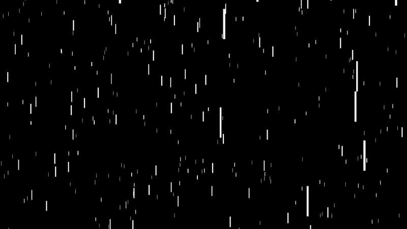

# unity-rain-2D
Inspired by the Code Train Challenge - Purple Rain. I created my version of the 2D rain in C# and with Unity as the renderer. Later it was applied at the start menu screen of another exercise project called Space Void.

The main files to read how the code works are [Line.cs](Purple_Rain/Assets/Scripts/Line.cs) and [Rain.cs](Purple_Rain/Assets/Scripts/Rain.cs)

The [Rain.unitypackage](Rain.unitypackage) file is the easiest way to import the project and check it inside Unity3D.

